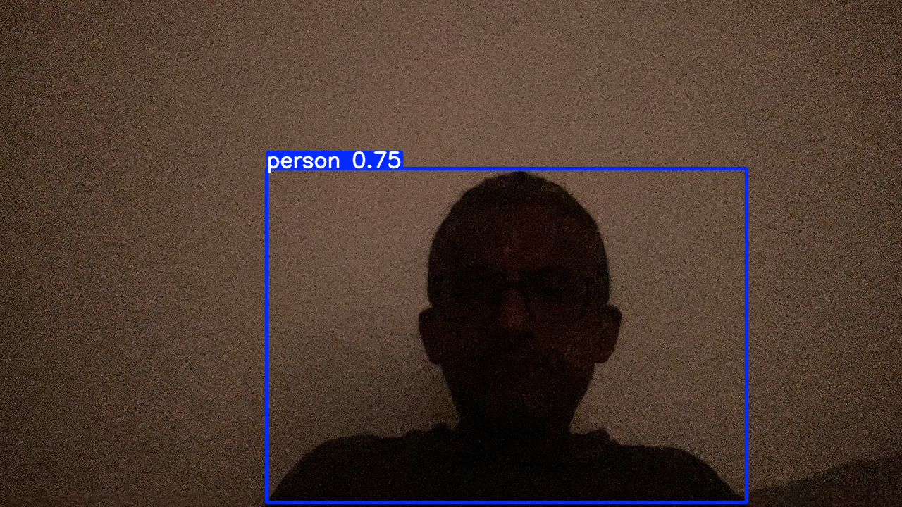

# Person Detection With Ultralytics YOLO

This project is a local prototype for detecting a person from a live Mac camera feed and logging a timestamped event in software only.

It is the first step of a larger "water gun" project. The current goal is deliberately narrow: prove that the detection pipeline works reliably before adding any hardware control.

## Current Scope

Step 1 is detection plus logging only.

What it does:
- Opens a local camera feed on macOS.
- Runs a pre-trained Ultralytics YOLO model locally.
- Detects the `person` class above a confidence threshold.
- Logs detection events with timestamps.

What it does not do yet:
- No servos.
- No pumps.
- No relays.
- No water actuation.

## Why This Design

The project starts with a standard person detector rather than an open-vocabulary model.

Reasons:
- It is simpler to get working end to end on a Mac.
- It is lighter-weight for a first prototype.
- It gives a stable baseline before introducing hardware or more flexible vision models.

YOLO was chosen for the first pass because it is fast, well-supported, and already strong enough for the narrow requirement here: "is there a person in frame or not?"

## Implementation Notes

The main app is `detect_and_log.py`.

It currently supports:
- configurable camera index
- configurable confidence threshold
- configurable cooldown between logged events
- optional preview window with bounding boxes

On this machine, camera index `0` resolved to an OBS-style virtual camera source, while camera index `1` resolved to the real webcam. The default was changed to `1` so the app uses the physical camera by default in this environment.

## Repository Layout

- `detect_and_log.py`: webcam detection app
- `requirements.txt`: Python dependencies
- `notes.md`: consolidated local project notes and planning

## Setup

```bash
python3 -m venv .venv
source .venv/bin/activate
pip install -r requirements.txt
```

## Run

Default run:

```bash
./.venv/bin/python detect_and_log.py
```

Run with preview window:

```bash
./.venv/bin/python detect_and_log.py --show-window
```

Useful options:

```bash
./.venv/bin/python detect_and_log.py --camera-index 1
./.venv/bin/python detect_and_log.py --confidence 0.5
./.venv/bin/python detect_and_log.py --cooldown 5
```

## Expected Behavior

When the app sees a person, it prints and logs a line like:

```text
2026-05-17T00:01:01 detected person
```

Runtime logs are written to `detections.log` when detections occur.

## Current Detection Screenshot

This screenshot was captured from the live preview while testing in a dim room:



## Validation So Far

The prototype has already been validated locally with:
- live webcam activation
- person detection in a dim room
- timestamped detection logging
- repeated detection tests by covering and uncovering the camera

One behavioral note from testing: the current cooldown logic can retrigger while a person remains continuously present after the cooldown expires. That is acceptable for a first pass, but not ideal if the intended behavior is "log only when a person disappears and reappears."

## Future Plan

### Step 2: Detection + Water Shooting Hardware

Once the software-only pipeline is stable, the next phase is to replace the logging action with hardware control.

Planned additions:
- hardware trigger instead of log-only action
- safety checks before actuation
- retention of the same detection pipeline from step 1

## Notes

The fuller working notes for this prototype are in `notes.md`.
